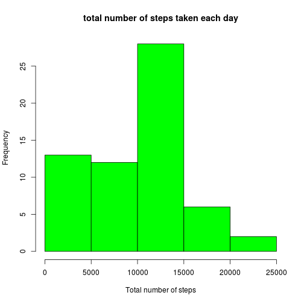
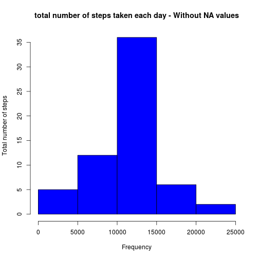
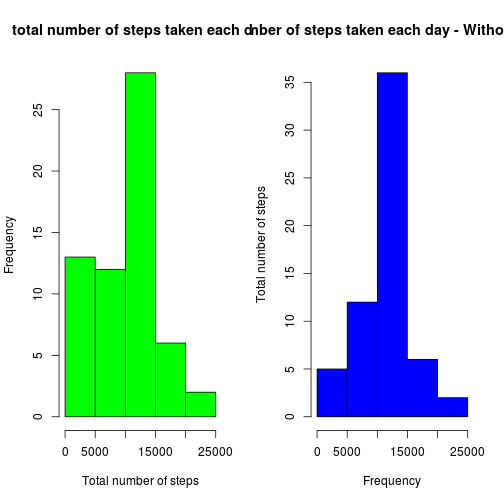
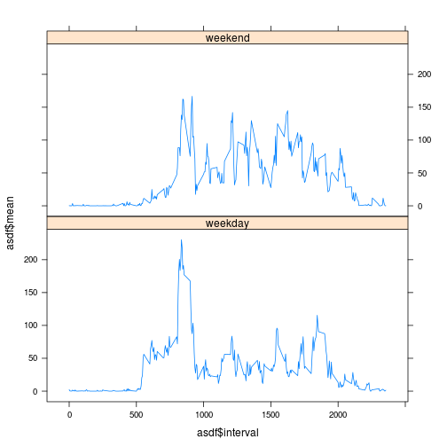

# Reproducible Research: Peer Assessment 1

## Introduction

It is now possible to collect a large amount of data about personal movement using activity monitoring devices such as a *Fitbit*, *Nike Fuelband*, or *Jawbone Up*. These type of devices are part of the **quantified self movement** – a group of enthusiasts who take measurements about themselves regularly to improve their health, to find patterns in their behavior, or because they are tech geeks. But these data remain under-utilized both because the raw data are hard to obtain and there is a lack of statistical methods and software for processing and interpreting the data.

This assignment makes use of data from a personal activity monitoring device. This device collects data at 5 minute intervals through out the day. The data consists of two months of data from an anonymous individual collected during the months of October and November, 2012 and include the number of steps taken in 5 minute intervals each day.

## Data

The data for this assignment can be downloaded from [dataset](https://d396qusza40orc.cloudfront.net/repdata%2Fdata%2Factivity.zip), into the course web site.

The variables included in this dataset are:

* ***steps***: Number of steps taking in a 5-minute interval (missing values are coded as NA)
* ***date***: The date on which the measurement was taken in YYYY-MM-DD format
* ***interval***: Identifier for the 5-minute interval in which measurement was taken

The dataset is stored in a comma-separated-value (CSV) file and there are a total of **17,568** observations in this dataset.

___

## Assignment Solution

### Loading and preprocessing the data

#### Step 1 - Load the data

In this step we will unzip `activity.zip` file and read the dataset.


```r
unzip('activity.zip')
activity <- read.csv('activity.csv')
```

Our data set has **1758** observations and **3** variables


```r
str(activity)
```

```
## 'data.frame':	17568 obs. of  3 variables:
##  $ steps   : int  NA NA NA NA NA NA NA NA NA NA ...
##  $ date    : Factor w/ 61 levels "2012-10-01","2012-10-02",..: 1 1 1 1 1 1 1 1 1 1 ...
##  $ interval: int  0 5 10 15 20 25 30 35 40 45 ...
```

#### Step 2 - Process/transform the data (if necessary) into a format suitable for your analysis

In this step we will transform `date` field from `factor` to `Date`


```r
activity$date <- as.Date(activity$date, format="%Y-%m-%d")
```


### What is mean total number of steps taken per day?

#### Step 1 - Make a histogram of the total number of steps taken each day

First we group the data by `date` and calculate the sum of steps per group. 


```r
totalStepsPerDay <- tapply(activity$steps, activity$date, sum, na.rm = TRUE)

# histogram
hist(totalStepsPerDay, col="green", main="total number of steps taken each day", xlab="Total number of steps", ylab = "Frequency")
```

 

#### Step 2 - Calculate and report the mean and median total number of steps taken per day


```r
meanTotalStepsPerDay <- mean(totalStepsPerDay)

medianTotalStepsPerDay <- median(totalStepsPerDay)
```

The values for `mean` and `median` are:

* **mean total number of steps taken per day**: 9354.2295
* **median total number of steps taken per day**: 10395

### What is the average daily activity pattern?

#### Step 1 - Make a time series plot (i.e. type = "l") of the 5-minute interval (x-axis) and the average number of steps taken, averaged across all days (y-axis)


```r
meanStepsPerDay <- tapply(activity$steps, activity$interval, mean, na.rm=TRUE)

plot(meanStepsPerDay, type = "l", main="Average number of steps taken on each 5-minute interval", xlab="Interval Number", ylab="Average number of steps")
```

 

#### Step 2 - Which 5-minute interval, on average across all the days in the dataset, contains the maximum number of steps?


```r
maxNumberStepsInterval <- which.max(meanStepsPerDay)
```

The interval with the maximun number of step is **104**. It corresponds to interval **835**


### Imputing missing values

Note that there are a number of days/intervals where there are missing values (coded as NA). The presence of missing days may introduce bias into some calculations or summaries of the data.

#### Step 1 - Calculate and report the total number of missing values in the dataset (i.e. the total number of rows with NAs)

To calculate the number of NAs, we will use the `is.na` function and `table` to compute how many.


```r
table(is.na(activity$steps))
```

```
## 
## FALSE  TRUE 
## 15264  2304
```

The number of NAs is : **2304**

#### Step 2 - Devise a strategy for filling in all of the missing values in the dataset. The strategy does not need to be sophisticated. For example, you could use the mean/median for that day, or the mean for that 5-minute interval, etc.

The strategi we will use is calculate the mean for each `interval` and assign that value to each NA into the interval. All steps will be execute over a copy of our original dataset.

#### Step 3 - Create a new dataset that is equal to the original dataset but with the missing data filled in.


```r
activityNoNA <- activity

# we add the mean to a new temporal column
activityNoNA$mean <- tapply(activityNoNA$steps, activityNoNA$interval, FUN=function(x) mean(x, na.rm=TRUE))

# we fill the NAs with the mean
for (i in 1:nrow(activityNoNA)) {
    if (is.na(activityNoNA$steps[i])) {
        activityNoNA$steps[i] <- activityNoNA$mean[i]
    }
}

# we remove unnecesary values
rm(i)
activityNoNA$mean <- NULL
```

The result of this step shows that first row changes the `steps` value from `0` to the median value for that interval.


```r
head(activityNoNA)
```

```
##     steps       date interval
## 1 1.71698 2012-10-01        0
## 2 0.33962 2012-10-01        5
## 3 0.13208 2012-10-01       10
## 4 0.15094 2012-10-01       15
## 5 0.07547 2012-10-01       20
## 6 2.09434 2012-10-01       25
```

#### Step 4 - Make a histogram of the total number of steps taken each day and Calculate and report the mean and median total number of steps taken per day. Do these values differ from the estimates from the first part of the assignment? What is the impact of imputing missing data on the estimates of the total daily number of steps?


```r
totalStepsPerDayNoNA <- tapply(activityNoNA$steps, activityNoNA$date, sum, na.rm = TRUE)

hist(totalStepsPerDayNoNA, col="blue", main="total number of steps taken each day - Without NA values", ylab="Total number of steps", xlab = "Frequency")
```

 


```r
meanTotalStepsPerDayNoNA <- mean(totalStepsPerDayNoNA)
medianTotalStepsPerDayNoNA <- median(totalStepsPerDayNoNA)
```

The values for `mean` and `median`, for this new dataset, are:

* **mean**: 1.0766 &times; 10<sup>4</sup>
* **median**: 1.0766 &times; 10<sup>4</sup>


```r
par(mfrow = c(1,2))
hist(totalStepsPerDay, col="green", main="total number of steps taken each day", xlab="Total number of steps", ylab = "Frequency")
hist(totalStepsPerDayNoNA, col="blue", main="total number of steps taken each day - Without NA values", ylab="Total number of steps", xlab = "Frequency")
```

 

When we compare both model we can see that, now, median an mean have same value and it increase due to the stategy we applied.


### Are there differences in activity patterns between weekdays and weekends?

For this part the weekdays() function may be of some help here. Use the dataset with the filled-in missing values for this part.

#### Step 1 - Create a new factor variable inac the dataset with two levels – “weekday” and “weekend” indicating whether a given date is a weekday or weekend day.


```r
activityNoNA$weekend <- weekdays(as.Date(activityNoNA$date, format="%Y-%m-%d")) %in% c("Saturday", "Sunday")
activityNoNA$weekend <- as.factor(activityNoNA$weekend)
levels(activityNoNA$weekend) <- c("weekday", "weekend")
```

#### Step 2 - Make a panel plot containing a time series plot (i.e. type = "l") of the 5-minute interval (x-axis) and the average number of steps taken, averaged across all weekday days or weekend days (y-axis).


```r
library(lattice)
library(plyr)

meanStepsPerDay <- tapply(activity$steps, activity$interval, mean, na.rm=TRUE)
asdf<-ddply(activityNoNA, .(weekend,interval), summarize, mean = mean(steps), sum = sum(steps))

xyplot(asdf$mean ~ asdf$interval | asdf$weekend, type="l",layout=c(1,2))
```

 
